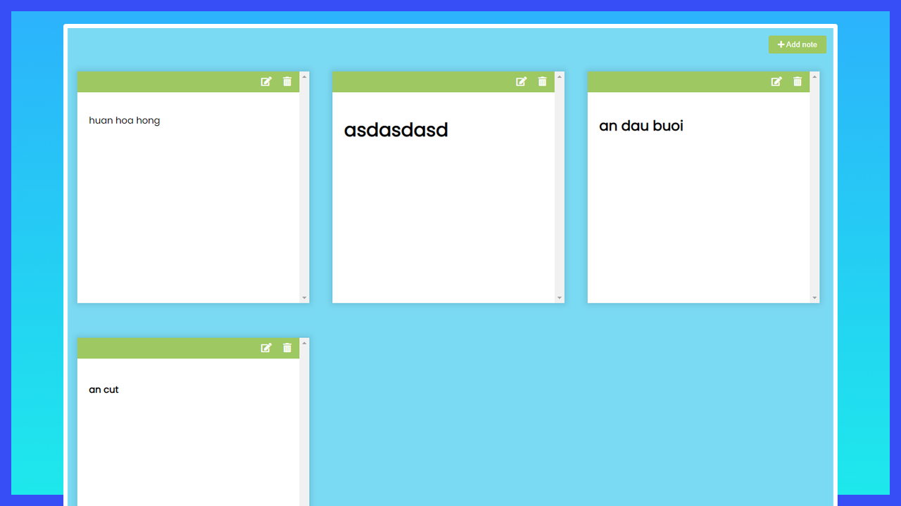
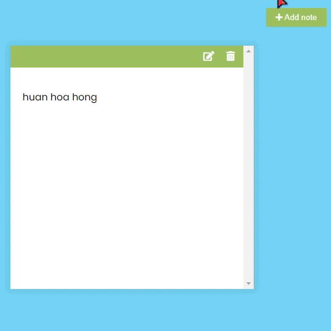

# Mini Project: Notes App

## Date: 01 - Mar - 2021

### Function

- Add new note
- Edit note with markdown (marked lib)
- Delete note
- Save notes in localStorage

### Screenshot

### Tech-Stack

- HTML/CSS
- JS

### Steps

- add Event click on addBtn to run func addNewNote
- func addNewNote
  - createElement 
 for note
  - add classList: note
  - create HTML for div.note
    - have 3 parts:
      - div.tools > button\*2 (edit, delete)
      - div.main : for display text
      - textarea
  - add value from text to textArea
  - add marked(markdown lib) to main
    - marked(text)
  - add event click on deleteBtn:
    - remove note
    - run updateLS()
  - add event click on editBtn:
    - toggle class hidden for main & textarea
  - add event click on textArea:
    - get value from textarea, marked(value)
    - run updateLS()
- function updateLS
  - get all notesText by queryAll textarea
  - push all notesText to notes[]
  - setItem notes to localStorage
- check notes is defined in localStorage
  - create notes = getItem notes from localStorage
  - notes ? addNewNote(note) : nothing

### After this project

I have improve my knowledge about:

- review my knowledge in html/css
- learn DOM Manipulation
