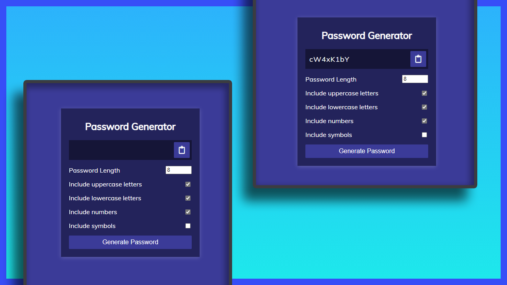
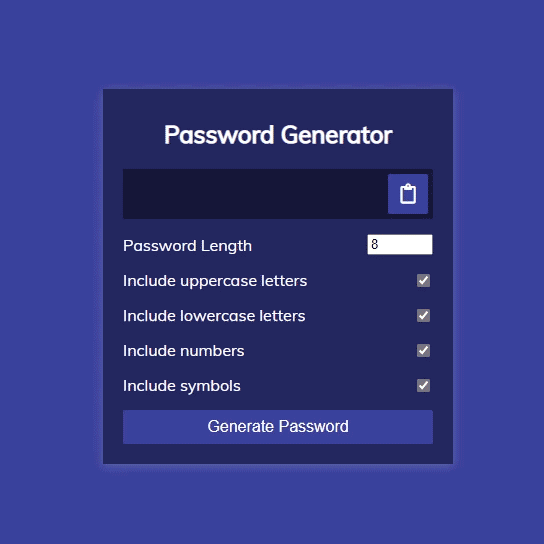

# Mini Project: Password Generator

## Date: 01 - Mar - 2021

### Function

- Generator random password

### Screenshot

### Tech-Stack

- HTML/CSS
- JS

### References:

- ASCII Code: [Link](https://theasciicode.com.ar/ascii-printable-characters/lowercase-letter-a-minuscule-ascii-code-97.html)
- from A to Z: 26 characters
- from 0 to 9: 10 characters

### Steps

- create HTML
- style css
- create randomFunc:
  - lower: getRandomLower,
  - upper: getRandomUpper,
  - number: getRandomNumber,
  - symbol: getRandomSymbol,
- function getRandomLower
  - lower charCode: from: 97(a) to 122(z)
  - so we get random number from 97 to 122
- function getRandomUpper
  - upper charCode: from: 65(A) to 90(Z)
  - so we get random number from 65 to 90
- function getRandomNumber
  - number charCode: from: 48(0) to 57(9)
  - so we get random number from 48 to 57
- function getRandomSymbol
  - symbols: !@#$%^&\*(){}[]=<>/,.
  - so we get random character in symbols[];
- function generatePassword
  - typesCount: count how many types
  - typesArr: filter type is T/F
  - typesCount === 0 ? "" :
  - for i > typesCount
    - forEach: typesArr for generatedPassword += randomFunc;
  - finalPassword = generatedPassword
- add event click on generateEl

  - define: length, hasLower, hasUpper, hasNumber, hasSymbol that is checked
  - innerText to resultEl by call function generatePassword which (hasLower, hasUpper, hasNumber, hasSymbol, length)

- add event click on clipboardEl
  - createElement: textarea
  - define password = resultEl;
  - !password return;
  - get value from password to textarea.value
  - body.appendChild: textarea
  - select textarea
  - document execCommand copy
  - remove textarea
  - popup alert: Copied success

### After this project

I have improve my knowledge about:

- review my knowledge in html/css
- learn DOM Manipulation
- How to define function "copy to clipboard"
  - create new textarea
  - transfer password to textarea
  - execCommand copy on textarea
  - remove textarea
