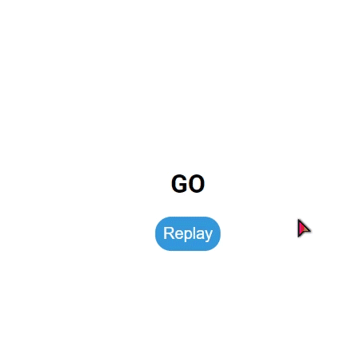

# Mini Project: Animated Countdown

## Date: 02 - Mar - 2021

### Screenshot

### Tech-Stack

- HTML/CSS
- JS

### Steps:

- create HTML
  - div.counter
    - div.nums > have 4 span: from 3 to 0
    - h4 > Get Ready
  - div.final
    - h1 > GO
    - button#replay
- style
- function runAnimation()
  - forEach nums >
    - define nextToLast: the last number in num
    - add event `animationend` to num
      - if animationName = `goIn` & index != nextToLast
        - add class `in` and remove class `out` to num
      - else if animationName = `goOut` & num.nextElementSibling
        - add class `in` to class beside of num
      - else
        - add `hide` to counter
        - add `show` to finalMessage
- function resetDOM()
  - remove `hide` in counter
  - remove `show` in finalMessage
  - remove all class that have in nums
    - value = ''
  - add class `in` to first num of nums
- add event click to replayBtn
  - run resetDOM()
  - run runAnimation()

### After this project

I have improve my knowledge about:

- review my knowledge in html/css
- learn DOM Manipulation
