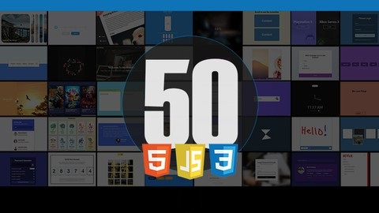

# Project: 50 Projects for learn, sharpen your HTML/CSS, JS Dom Skills

## Date: 9 - Dec - 2020



### Functions

- 50 unique mini-projects to sharpen your HTML, CSS & JavaScript skills
- create interesting projects

### Tech-Stack

- HTML/CSS
- JavaScript
- Fetch API

### Project

|  #  | Date      | Project                | Repository                                                                                          |
| :-: | --------- | ---------------------- | --------------------------------------------------------------------------------------------------- |
| 01  | 09-Dec-20 | Expanding Cards        | [Repository](https://github.com/tinspham209/50projects50days/tree/master/01-expanding-cards)        |
| 02  | 09-Dec-20 | Progress Steps         | [Repository](https://github.com/tinspham209/50projects50days/tree/master/02-progress-steps)         |
| 03  | 09-Dec-20 | Rotating Nav Animation | [Repository](https://github.com/tinspham209/50projects50days/tree/master/03-rotating-nav-animation) |
| 04  | 12-Dec-20 | Hidden Search Widget   | [Repository](https://github.com/tinspham209/50projects50days/tree/master/04-hidden-search-widget)   |
| 05  | 12-Dec-20 | Blurry Loading         | [Repository](https://github.com/tinspham209/50projects50days/tree/master/05-blurry-loading)         |
| 06  | 12-Dec-20 | Scroll Animation       | [Repository](https://github.com/tinspham209/50projects50days/tree/master/06-scroll-animation)       |
| 07  | 04-Jan-21 | Split Landing Page     | [Repository](https://github.com/tinspham209/50projects50days/tree/master/07-split-landing-page)     |
| 08  | 04-Jan-21 | Form Input Wave        | [Repository](https://github.com/tinspham209/50projects50days/tree/master/08-form-input-wave)        |
| 09  | 04-Jan-21 | Sound Board            | [Repository](https://github.com/tinspham209/50projects50days/tree/master/09-sound-board)            |
| 10  | 06-Jan-21 | Dad Jokes              | [Repository](https://github.com/tinspham209/50projects50days/tree/master/10-dad-jokes)              |
| 11  | 06-Jan-21 | Event KeyCodes         | [Repository](https://github.com/tinspham209/50projects50days/tree/master/11-event-keycodes)         |
| 12  | 06-Jan-21 | FAQ Collapse           | [Repository](https://github.com/tinspham209/50projects50days/tree/master/12-faq-collapse)           |
| 13  | 11-Jan-21 | Random Choice Picker   | [Repository](https://github.com/tinspham209/50projects50days/tree/master/13-random-choice-picker)   |
| 14  | 11-Jan-21 | Animated Navigation    | [Repository](https://github.com/tinspham209/50projects50days/tree/master/14-animated-navigation)    |
| 15  | 11-Jan-21 | Incrementing Counter   | [Repository](https://github.com/tinspham209/50projects50days/tree/master/15-incrementing-counter)   |
| 16  | 18-Jan-21 | Drink Water            | [Repository](https://github.com/tinspham209/50projects50days/tree/master/16-drink-water)            |
| 17  | 20-Jan-21 | Movie App              | [Repository](https://github.com/tinspham209/50projects50days/tree/master/17-movie-app)              |
| 18  | 25-Jan-21 | Background Slider      | [Repository](https://github.com/tinspham209/50projects50days/tree/master/18-background-slider)      |
| 19  | 25-Jan-21 | Theme Clock            | [Repository](https://github.com/tinspham209/50projects50days/tree/master/19-theme-clock)            |
| 20  | 26-Jan-21 | Button Ripple Effect   | [Repository](https://github.com/tinspham209/50projects50days/tree/master/20-button-ripple-effect)   |
| 21  | 26-Jan-21 | Drag & Drop            | [Repository](https://github.com/tinspham209/50projects50days/tree/master/21-drag-n-drop)            |
| 22  | 26-Jan-21 | Drawing App            | [Repository](https://github.com/tinspham209/50projects50days/tree/master/22-drawing-app)            |
| 23  | 28-Jan-21 | Kinetic Loader         | [Repository](https://github.com/tinspham209/50projects50days/tree/master/23-kinetic-loader)         |
| 24  | 28-Jan-21 | Content Placeholder    | [Repository](https://github.com/tinspham209/50projects50days/tree/master/24-content-placeholder)    |
| 25  | 03-Feb-21 | Sticky Navigation      | [Repository](https://github.com/tinspham209/50projects50days/tree/master/25-sticky-navigation)      |
| 26  | 03-Feb-21 | Double Vertical Slider | [Repository](https://github.com/tinspham209/50projects50days/tree/master/26-double-vertical-slider) |

### Commit

#### <a name="commit-header"></a>Commit Message Format

```
<type>(<scope>): <short summary>
  │       │             │
  │       │             └─⫸ Summary in present tense. Not capitalized. No period at the end.
  │       │
  │       └─⫸ Commit Scope: animations|bazel|benchpress|common|compiler|compiler-cli|core|
  │                          elements|forms|http|language-service|localize|platform-browser|
  │                          platform-browser-dynamic|platform-server|router|service-worker|
  │                          upgrade|zone.js|packaging|changelog|dev-infra|docs-infra|migrations|
  │                          ngcc|ve
  │
  └─⫸ Commit Type: build|ci|docs|feat|fix|perf|refactor|test
```

The `<type>` and `<summary>` fields are mandatory, the `(<scope>)` field is optional.

#### <a name="commit-header"></a>Commit Message Example

- `feat(similarityReports): get similarity reports and display in a grid`
- `update(similarityReports): add updatedDate col in the report grid`
- `fix(similarityReports): display correct message error`
- `update(global): change css system`

### After this project
